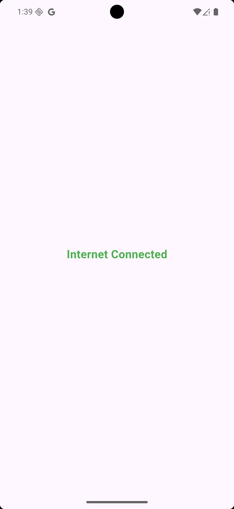
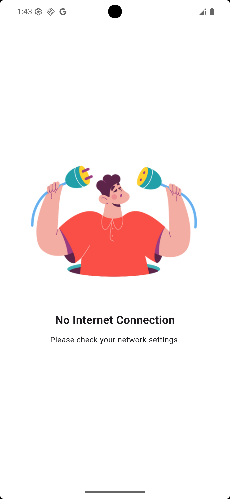

# Internet Check-In App

A comprehensive Flutter package for handling internet connectivity status in your application. It provides a simple, plug-and-play solution to monitor network changes and automatically display a "No Internet" screen when the connection is lost.

[](https://pub.dev/packages/internet_check_in_app)
[](https://opensource.org/licenses/MIT)

## Features

*   **Real-time Monitoring**: Instantly detects when internet connectivity is lost or restored.
*   **Automatic UI Handling**: Automatically navigates to a "No Internet" screen when disconnected and returns to the previous screen when connected.
*   **Customizable**: Use the default "No Internet" screen or provide your own custom widget.
*   **Cross-Platform**: Supports Android and iOS.

### UI Examples

<div style="display: flex; gap: 20px;">
  
  
</div>
  
## Permissions

### Android

Add the following permissions to your `AndroidManifest.xml` file:

```xml
<uses-permission android:name="android.permission.INTERNET" />
<uses-permission android:name="android.permission.ACCESS_NETWORK_STATE" />
```

### iOS

No specific permissions are required for basic connectivity checking.


## Getting Started

Add the package to your `pubspec.yaml` file:

```yaml
dependencies:
  internet_check_in_app: ^0.0.3
```

Or install it via command line:

```bash
flutter pub add internet_check_in_app
```

## Usage

This package is **state management agnostic** - it works with any Flutter application regardless of whether you use GetX, BLoC, Provider, Riverpod, or no state management at all. Simply wrap your app with `ConnectivityListener` and it will automatically handle internet connectivity monitoring.

### 🎯 Recommended Setup (Works with Any State Management)

The best approach is to wrap your entire application using the `builder` property of `MaterialApp`. This ensures connectivity monitoring works globally across your entire app.

**Basic Setup (No State Management Required):**

```dart
import 'package:flutter/material.dart';
import 'package:internet_check_in_app/internet_check_in_app.dart';

void main() {
  runApp(const MyApp());
}

class MyApp extends StatelessWidget {
  const MyApp({super.key});

  @override
  Widget build(BuildContext context) {
    // 1. Create a GlobalKey for the Navigator
    final GlobalKey<NavigatorState> navigatorKey = GlobalKey<NavigatorState>();

    return MaterialApp(
      // 2. Assign the navigatorKey to MaterialApp
      navigatorKey: navigatorKey,
      // 3. Wrap your app with ConnectivityListener in the builder
      builder: (_, child) {
        return ConnectivityListener(
          navigatorKey: navigatorKey,
          child: child!,
        );
      },
      home: const HomePage(),
    );
  }
}

class HomePage extends StatelessWidget {
  const HomePage({super.key});

  @override
  Widget build(BuildContext context) {
    return Scaffold(
      appBar: AppBar(title: const Text("Home")),
      body: const Center(child: Text("Your App Content")),
    );
  }
}
```

### 📱 Usage with GetX

If you're using GetX for state management, the package works seamlessly:

```dart
import 'package:flutter/material.dart';
import 'package:get/get.dart';
import 'package:internet_check_in_app/internet_check_in_app.dart';

void main() {
  runApp(const MyApp());
}

class MyApp extends StatelessWidget {
  const MyApp({super.key});

  @override
  Widget build(BuildContext context) {
    final GlobalKey<NavigatorState> navigatorKey = GlobalKey<NavigatorState>();

    return GetMaterialApp(  // Using GetMaterialApp instead of MaterialApp
      navigatorKey: navigatorKey,
      builder: (_, child) {
        return ConnectivityListener(
          navigatorKey: navigatorKey,
          child: child!,
        );
      },
      home: const HomePage(),
    );
  }
}
```

### 🎨 Usage with BLoC

If you're using BLoC pattern, it works perfectly:

```dart
import 'package:flutter/material.dart';
import 'package:flutter_bloc/flutter_bloc.dart';
import 'package:internet_check_in_app/internet_check_in_app.dart';

void main() {
  runApp(const MyApp());
}

class MyApp extends StatelessWidget {
  const MyApp({super.key});

  @override
  Widget build(BuildContext context) {
    final GlobalKey<NavigatorState> navigatorKey = GlobalKey<NavigatorState>();

    return MaterialApp(
      navigatorKey: navigatorKey,
      builder: (_, child) {
        return MultiBlocProvider(
          providers: [
            BlocProvider(create: (_) => YourBloc()),
            // Add your other BLoCs here
          ],
          child: ConnectivityListener(
            navigatorKey: navigatorKey,
            child: child!,
          ),
        );
      },
      home: const HomePage(),
    );
  }
}
```

### 🎯 Local Usage (Specific Screens Only)

If you only want to monitor connectivity on specific screens:

```dart
class MyScreen extends StatelessWidget {
  const MyScreen({super.key});

  @override
  Widget build(BuildContext context) {
    return ConnectivityListener(
      child: Scaffold(
        appBar: AppBar(title: const Text("My Screen")),
        body: const Center(child: Text("Content")),
      ),
    );
  }
}
```

### 🎨 Custom "No Internet" Screen

You can provide your own custom widget to display when internet is lost:

```dart
ConnectivityListener(
  navigatorKey: navigatorKey,
  noInternetWidget: MyCustomNoInternetPage(),
  child: child!,
)
```

**Example Custom Widget:**

```dart
class MyCustomNoInternetPage extends StatelessWidget {
  const MyCustomNoInternetPage({super.key});

  @override
  Widget build(BuildContext context) {
    return Scaffold(
      backgroundColor: Colors.red,
      body: Center(
        child: Column(
          mainAxisAlignment: MainAxisAlignment.center,
          children: [
            const Icon(Icons.wifi_off, size: 100, color: Colors.white),
            const SizedBox(height: 20),
            const Text(
              'No Internet Connection',
              style: TextStyle(color: Colors.white, fontSize: 24),
            ),
          ],
        ),
      ),
    );
  }
}
```

## Platform Support

| Platform | Support |
| :--- | :---: |
| Android | ✅ |
| iOS | ✅ |

This package relies on [connectivity_plus](https://pub.dev/packages/connectivity_plus), so it supports all platforms supported by that plugin.

## Contributing

Contributions are welcome! If you find a bug or want to feature, please open an issue or submit a pull request on the [GitHub repository](https://github.com/shahidjaber90/Internet_Check_In_App).
